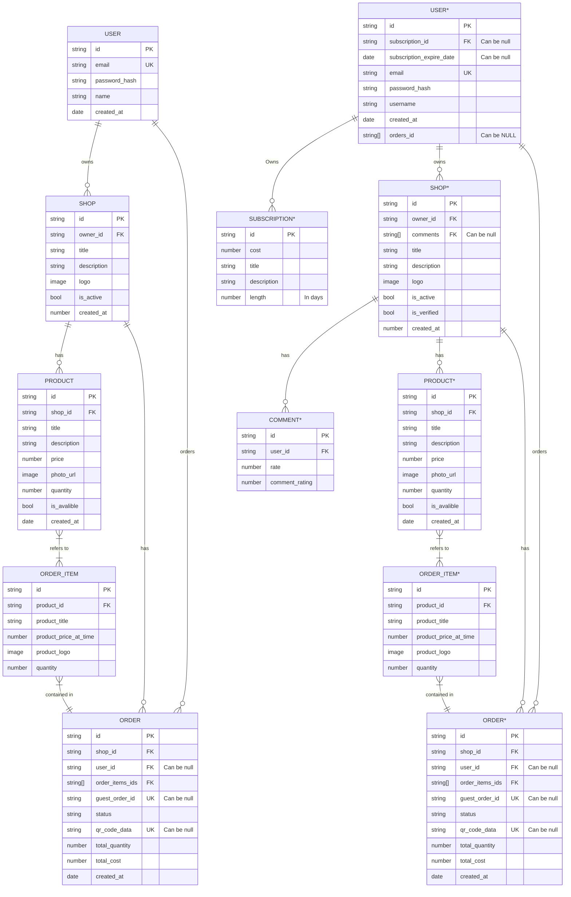

# Database
{: .no_toc }

<!-- ## Table Of contents -->
<!-- {: .no_toc .text-delta } -->

<!-- 1. TOC -->
<!-- {:toc} -->

---

## Our database right now vc what we are going for

---

## Relationship Syntax

| Value (left) | Value (right) | Meaning |
|--------------|---------------|---------|
| \|o	         | o\|	         | Zero or one |
| \|\|         | \|\|	         | Exactly one |
| }o           | o{	           | Zero or more (no upper limit) |
| }\|          | \|{	         | One or more (no upper limit)  |

Read more about this [here](https://mermaid.js.org/syntax/entityRelationshipDiagram.html#relationship-syntax).
