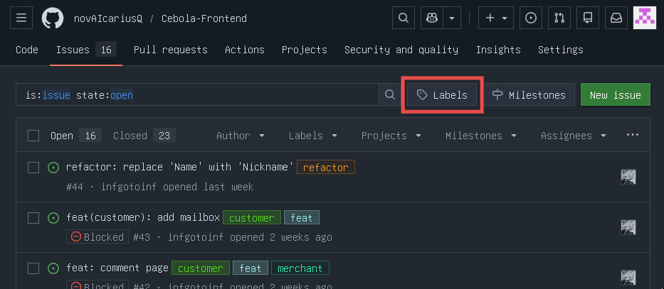

# Github issues and pull requests
{: .no_toc }

This page contains recommendations that are common to issues and pull requests. For more information about something specific relate to it's page.

## Table Of contents
{: .no_toc .text-delta }

1. TOC
{:toc}

---

## Tense

Issues and pull requests must be written in **imperative, present tense** [as well as git commits](../git-commits/#commit-tense).

## Title

Title must be a brief explanation of the change.

- Must have size of *50 characters* or **72 maximum** [as well as git commits](../git-commits/#line-size) (this rule applies only to the title)
- Must follow [git commit syle guide for subject line](../git-commits/#subject-line)
  - If it is a complex issue that involves differen types of changes, then *type can be avoided* and issue must be broken down in sub-issues.

Structure title as you structure subject line for commit message:

> <b><a href="../git-commits/#types">&lt;type&gt;</a></b>(<b><a href="../git-commits/#scopes">&lt;optional scope&gt;</a></b>): <b><a href="../git-commits/#description">&lt;description&gt;</a></b>

## Labels

Labels are **mandatory** and needed to categorize issues and pull requests.

Most of the labels are same as [types in git commit guide](../git-commits/#types), while the others are self explanatory.

<!-- Meh, I think we don't need this one

### What if repository don't have a label you need?

You can go to labels page by going to `<link-to-gh-repo>/labels` or from issues or pull requests page like so:



Here you can add, remove and edit labels if you have a permission for that.

If you need to copy leabels from one repo to another there is an easier way to do that, rather than manual coppying. -->

### How to copy labels from one repo to another?

For this you'll need to have `github-cli` installed on your machine and be logged in github via `gh auth login`.

1. Clone the repo that you want to copy labels to.
2. Run
   ```
   gh label clone <repo_link>
   ```
   Where `<repo_link>` is the link to a repo you want to clone labels from.
   - If you want, you can use my repo with all common labels
     ```bash
     gh label clone https://github.com/infgotoinf/BT
     ```
