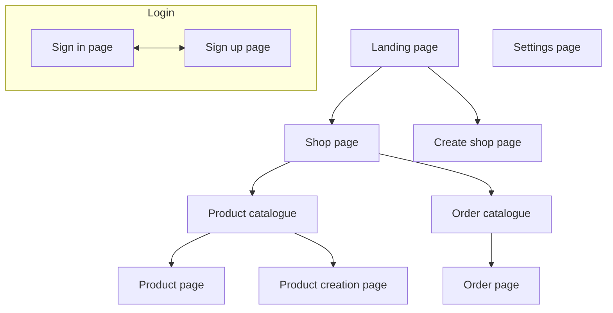

# Usefull tools
{: .no_toc }

## Table Of contents
{: .no_toc .text-delta }

1. TOC
{:toc}

---

## Github-cli

Github-cli is a very usefull tool, that let's you do github related actions right from your terminal. Examples of that github-cli can do:

- [Copying labels from one repo to another](../github-issues-and-pull-requests/#how-to-copy-labels-from-one-repo-to-another)
  ```text
  gh label clone https://github.com/infgotoinf/BT
  ```
- [Creating a pull request](../github-issues-and-pull-requests/pull-requests/#how-to-create-a-pull-request-from-command-line)
  ```text
  gh pr create
  ```
- Creating a repo
  ```text
  gh repo create
  ```

It also has many usefull plugins such as [gh-dash](https://github.com/dlvhdr/gh-dash) (for managing pull requests and issues) and [gh-markdown-preview](https://github.com/yusukebe/gh-markdown-preview).

## Extended markdown

### Mermaid

Mermaid is a tool to create diagrams with a simple code. It is integrated with Github markdown and is a very good way to visualize structures, databases, tables and everything else.

Example of using mermaid in github issue:


The code of example:





Mermaid has a [very vast documentation](https://mermaid.ai/open-source/intro/) and it's very simple, so you will have no problems learning it.

### Images

Of course you know that you can add images to markdown, I just want you to use this markdown functionality, because of how usefull it is and how much you can explain and show with it:


To show that you mean and want, you can just take screenshots or to show more complex things use whatever graphical editor you'd like. I use [Krita](https://krita.org/en/), you can think of it as a sorta FOSS Photoshop and a drawing app, but it can be kinda heavy for something simple. For in-browser solution I would recommend something like [Pixlr](https://pixlr.com/editor/), it's pretty good and don't require registration.
