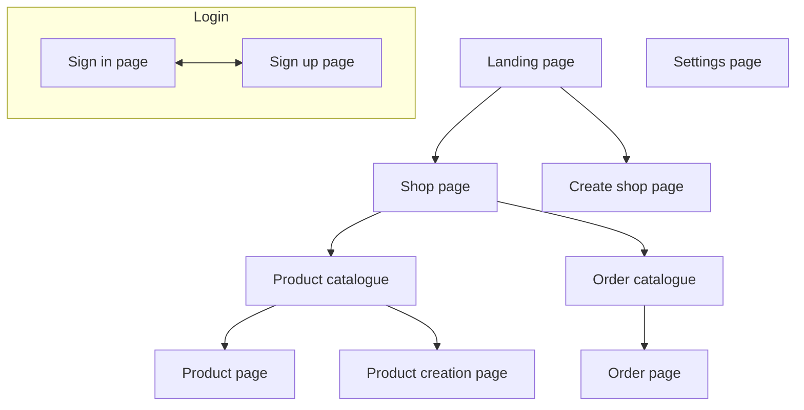

# Usefull tools
{: .no_toc }

## Table Of contents
{: .no_toc .text-delta }

1. TOC
{:toc}

---

## Github CLI

Github CLI is a very useful tool that lets you perform **Github-related actions** right from your **terminal**. Examples of what `github-cli` can do:

- [Copying labels from one repo to another](../github-issues-and-pull-requests/#how-to-copy-labels-from-one-repo-to-another):
  ```text
  gh label clone https://github.com/infgotoinf/BT
  ```
- [Creating a pull request](../github-issues-and-pull-requests/pull-requests/#how-to-create-a-pull-request-from-command-line):
  ```text
  gh pr create
  ```
- Creating a repository:
  ```text
  gh repo create
  ```

It also has many useful plugins, such as [gh-dash](https://github.com/dlvhdr/gh-dash) (for managing pull requests and issues via TUI) and [gh-markdown-preview](https://github.com/yusukebe/gh-markdown-preview).


## Extended Markdown

### Mermaid

Mermaid is a tool for creating **diagrams from** simple **code**. It's *integrated into Github-flavored Markdown* (the dialect of Markdown that Github uses) and is a good, easy-to-edit way to visualize structures, databases, tables, and other information.

Example of using Mermaid in Github issue:


The code of example:





Mermaid has a [very vast documentation](https://mermaid.ai/open-source/intro/) and it's very simple, so you'll have no problems learning it.

### Images

Of course you know that you can add images to Markdown, I just want you to **use this Markdown functionality**, because of how usefull it is and how much you can show and explain with images:


For something simple you can just take screenshots, for more complex things use whatever graphical editor you'd like. I use [Krita](https://krita.org/en/), you can think of it as a sorta FOSS Photoshop and a drawing app, but it can be kinda heavy for something simple. For in-browser solution I'd recommend something like [Pixlr](https://pixlr.com/editor/), it's pretty featureful and don't require registration.
